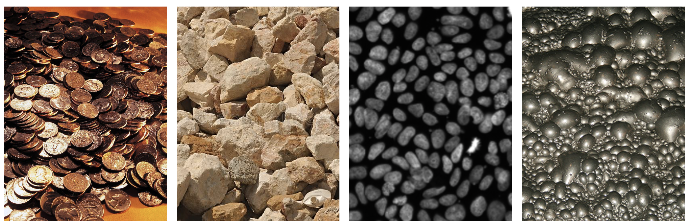
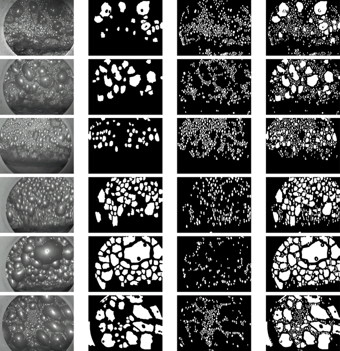
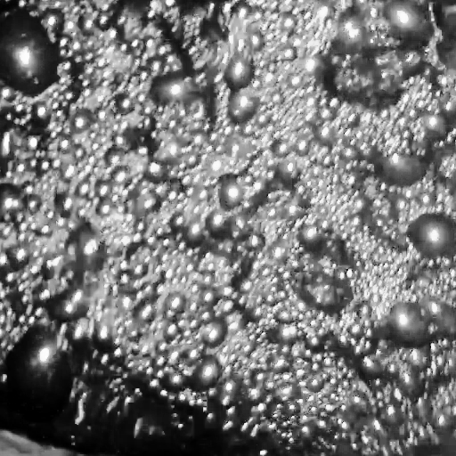
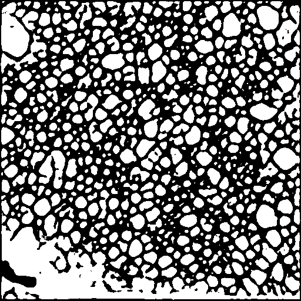
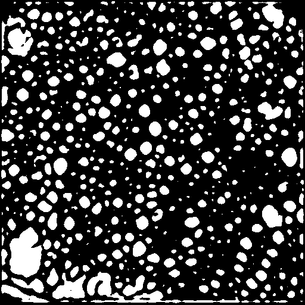
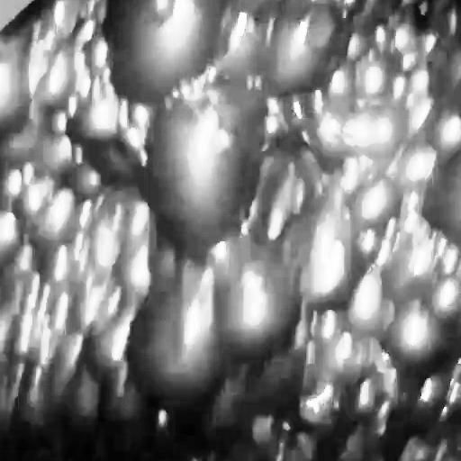
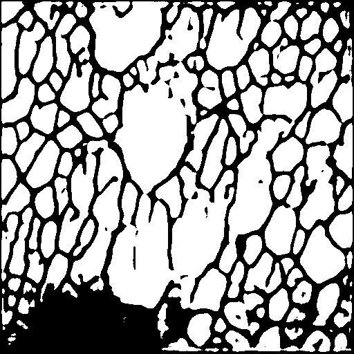
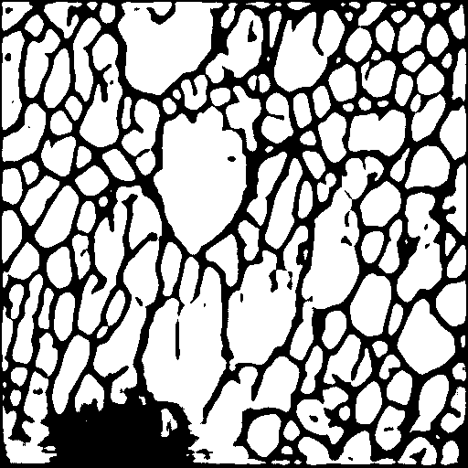

CTCI - Clumped texture composite images projects 
==============================

Clumped texture composite images - изображения со скучкованными сложными данными, образующие текстуру. Такое изображение (или видео) подразумевает, что на одном изображении будут находиться множество объектов одного класса, находящихся в куче, т.е. перекрывая друг друга, в случайном порядке. Примерами таких данных могут являться пузыри, камни, любые одинаковые изделия на конвейере.



Трудностью работой с такими данными являются отсутствие разметки в свободном доступе, трудоемкость разметки, требование к высокому качеству результатов.
Библиотека содержит методы, позволяющие автоматизировать процесс создания лейблов с помощью методов слабой разметки, методы самообучения и переноса между доменами.  Также представлены результаты обучения нескольких видов моделей на однотипных данных.

# Установка
1. Скачайте репозиторий по ссылке:
   ```git clone https://github.com/CTLab-ITMO/CTCI.git```
2. Перейдите в директорию проект
   ```cd CTCI```
3. Установите зависимости
```pip -r install requirements.txt```

# Слабая разметка

Слабая разметка однородных данных реализована с использованием моделей YOLOv8 и Segment Anything, а также с помощью алгоритма сегментации водоразделом. YOLOv8 используется для поисков маркеров, соответствующих крупным пузырям, SAM для поиска контуров крупных пузырей, водораздел для поиска контуров мелких пузырей. 

Функционал слабой разметки расположен в модуле `src/data/weakly_segmentation/annotation.py` в методе `annotation`. Разметка выполняется для указанной в аргументах папки с данными

Пример использования:

```python
import sys

from src.data.weakly_segmentation.annotation import annotation


data_dir = sys.argv[1]  # Директория, в которой лежат папки для разметки.
folder = sys.argv[2]    # Название папки, которую надо разметить
                        # ├──data_dir
                        #         ├── folder1
                        #         ├── folder2
                        #         ....

custom_yolo_checkpoint_path = sys.argv[3]  # Путь до весов модели YOLOv8
sam_checkpoint = sys.argv[4]  # Путь до весов модели SAM
sam_model_type = sys.argv[5]  # Тип модели SAM

narrowing = 0.20  # Значение сужения масок сегменатации. Предотвращает сливание масок однородных объектов
erode_iterations = 1  # Количество итераций эрозии 
processes_num = 3  # Количество параллельных процессов сегментации изображений
prompt_points = False  # Использование точек в промпте SAM

device = "cpu"  # Девайс, на котором выполняется разметка

annotation(
    data_dir, folder,
    custom_yolo_checkpoint_path, sam_checkpoint, sam_model_type, narrowing=narrowing,
    erode_iterations=erode_iterations, processes_num=processes_num, prompt_points=prompt_points,
    device=device
)
```
Результаты аннотации:


Результаты аннотации на различных данных. Важно отметить, что алгоритм не работает в режиме реального времени, медиа показывает визуализацию.


# Самообучение

## Алгоритмы самообучения 

Для реализации самообучения были выбраны алгоритмы barlow twins и MoCo

Barlow twins возможно можно реализовать при помощи соответствующего класс: 
```python
from barlow_twins import BarlowTwins

args = { 
    "batch_size" : 50, # Размер батчей при обучении
    "MLP" : "8192-8192-8912" # Структура  полносвязной сети 
}

model = BarlowTwins(args)

```
Энкодеры можно обучить в формате MoCo при помощи соответсвующих функций: 
```python
from train_moco import train

device = "cpu"

model_q = Net().to(device) #  2 энкодера, которые в связке обучаются 
model_k = copy.deepcopy(model_q) 

optimizer = optim.SGD(model_q.parameters(), lr=0.0001, weight_decay=0.0001) # Алгоритм оптимизации 
queue = initialize_queue(model_k, device, train_loader) # Очередь из объектов на которых обучается сеть 
epoch = 50 # Количество эпох 

train(model_q, model_k, device, train_loader, queue, optimizer, epoch)

```

## Обучение моделей 

### Скрипт обучения модели на основе Barlow Twins

```bash
python src/models/'barlow twins'/barlow_twins.py images_path masks_path target_height target_width batch_size epochs
```

```images_path``` - путь к изображениям 

```masks_path``` - путь к маскам

```target_height``` - итоговая высота изображения

```target_width``` - итоговая ширина изображения 

```batch_size```  - размер батча при обучении 

```epochs`` - количество эпох обучения 

### Скрипт обучения для моделей на основе MoCo (Momentum contrast) 

```bash
python src/models/moco/train_moco.py images_path masks_path out_dir batch_size epochs
```

`images_path``` - путь к изображениям 

```masks_path``` - путь к маскам

```out_dir``` - путь сохранения результата 

```batch_size``` - размер батча при обучении 

```epochs``` - количесто эпох обучения 

## Результаты работы алгоритмов самообучения 

| Исходное изорбражение  | Barlow twins | MoCo | 
| ------------- | ------------- | -------------| 
|   |   |  |
|   |   |  |


=======

# Сегментация

## Конфигурационные файлы

Для удобства обучения и использования моделей, мы используем конфигурационные файлы, примеры которых можно найти в директории `src/infrastructure/configs` . Мы рекомендуем придерживаться структуры, указанной в них.

## Модели сегментации

Для сегментации изображений однородных данных реализованы такие модели, как: Yolov8, SegFormer, Swin+UNETR, DeepLabv3, HRNet. Данные модели расположены в директориях `src/models/<название модели>` . 

Возможна инициализация модели с помощью соответствующего класса, например:

```python
net = transformers.SegformerForSemanticSegmentation.from_pretrained(
    f"nvidia/{model_name}-{model_type}-finetuned-ade-512-512",
    num_labels=1,
    image_size=image_size_height,
    ignore_mismatched_sizes=True
)

segformer = SegFormer(
    net=net, mask_head=final_layer, loss_fn=loss_fn,
    image_size=image_size, device=device
)


Все модели сегментации наследуются от класса ```BaseModel```.
```

либо, с помощью метода `build_<название модели>`, например:

```python
config_handler = read_yaml_config(config_path) # обработчик конфигурационных файлов
model = build_segformer(config_handler)
```

[//]: # (я не шарю за хтмл поэтому оставлю это здесь)


<details>
    <summary> Segformer </summary>

Инициализация Segformer из файла конфигурации.
```python
from src.models.segformer.model import build_segformer
config_handler = read_yaml_config(config_path) # обработчик конфигурационных файлов
model = build_segformer(config_handler)
```


Результаты обучения модели:


</details>


<details>
    <summary> Swin-UNETR  </summary>

Инициализация Swin-UNETR из файла конфигурации.
```python
from src.models.swin.model import build_swin
config_handler = read_yaml_config(config_path) # обработчик конфигурационных файлов
model = build_swin(config_handler)
```
Результаты обучения модели:


</details>


<details>
    <summary>  HRNet  </summary>

Инициализация HRNet из файла конфигурации.
```python
from src.models.hrnet.model import build_hrnet
config_handler = read_yaml_config(config_path) # обработчик конфигурационных файлов
model = build_hrnet(config_handler)
```
Результаты обучения модели:


</details>

<details>
    <summary>  DeepLabV3  </summary>

Инициализация DeepLabV3 из файла конфигурации.
```python
from src.models.deeplab.model import build_deeplab
config_handler = read_yaml_config(config_path) # обработчик конфигурационных файлов
model = build_deeplab(config_handler)
```
Результаты обучения модели:


</details>


<details>

    <summary>  YOLOv8  </summary>
Для inference YOLOv8 необходимо перейти в директорию CTCI/src/models/yolov8 и запустить в командной строке скрипт:
```shell
python3 CTCI/src/models/yolov8/<task_script.py> <path to input image> <path to output image> <path to model weights>
```
</details>


## Обучение моделей

Для обучения или дообучения моделей добавлен класс тренировщика `Trainer` , расположенный в модуле `src/models/train.py` :

```python
trainer = Trainer(
    model=model,
    optimizer=optimizer,
    scheduler=scheduler,
    metrics=metrics,
    main_metric_name=main_metric_name,
    save_dir=model_save_dir,
    device=device
)
```

В директории `src/infrastructure/models_tracking`  расположены скрипты, позволяющие обучить или дообучить модели “из коробки” с использованием конфигурационного файла. Пример использования:

```bash
python src/infrastructure/models_tracking/segformer_tracking.py <config_path>
```


### ADELE
Библиотека поддерживает [Adaptive Early-Learning Correction for Segmentation from Noisy Annotations](https://arxiv.org/abs/2110.03740). Для использования достаточно создать датасет **без аугментаций**, то есть без аффинных преобразований, но в том виде, в котором модель будет получать изображения на инференсе. В класс тренировщика необходимо будет передавать отдельно инициализированный датасет из тренировочных файлов. В файле конфигураций необходимо добавить шаг, через который будет применяться метод. 

```python
# В файле трекинга добавить следующие строки

from src.models.utils.config import read_yaml_config
from src.features.segmentation.dataset import get_train_dataset_by_config

config_handler = read_yaml_config(config_path)
adele_dataset = get_train_dataset_by_config(
        config_handler,
        transform=tr, # стандартные преобразования
        augmentation_transform=None
    )
adele_dataset.return_names = True
```


# Экспорт в ONNX

Описанные выше модели могут быть экспортированы в onnx формат для дальнейшего запуска в любом окружении, поддерживающем onnx-runtime. 

Экспорт каждой из моделей можно выполнить с использованием заготовленных скриптов, расположенных в директории `src/infrastructure/models_inference` . Например:

```bash
python src/infrastructure/models_inference/segformer_export.py <config_path>
```

Исходный код конвертации и квантизации находиться в модуле `src/models/inference.py` .


Организация проекта
------------

    ├── LICENSE
    ├── Makefile           <- Makefile with commands like `make data` or `make train`
    ├── README.md          <- The top-level README for developers using this project.
    ├── data
    │   ├── external       <- Data from third party sources.
    │   ├── interim        <- Intermediate data that has been transformed.
    │   ├── processed      <- The final, canonical data sets for modeling.
    │   └── raw            <- The original, immutable data dump.
    │
    ├── docs               <- A default Sphinx project; see sphinx-doc.org for details
    │
    ├── models             <- Trained and serialized models, model predictions, or model summaries
    │
    ├── notebooks          <- Jupyter notebooks. Naming convention is a number (for ordering),
    │                         the creator's initials, and a short `-` delimited description, e.g.
    │                         `1.0-jqp-initial-data-exploration`.
    │
    ├── references         <- Data dictionaries, manuals, and all other explanatory materials.
    │
    ├── reports            <- Generated analysis as HTML, PDF, LaTeX, etc.
    │   └── figures        <- Generated graphics and figures to be used in reporting
    │
    ├── requirements.txt   <- The requirements file for reproducing the analysis environment, e.g.
    │                         generated with `pip freeze > requirements.txt`
    │
    ├── setup.py           <- makes project pip installable (pip install -e .) so src can be imported
    ├── src                <- Source code for use in this project.
    │   ├── __init__.py    <- Makes src a Python module
    │   │
    │   ├── data           <- Scripts to download or generate data
    │   │   └── make_dataset.py
    │   │
    │   ├── features       <- Scripts to turn raw data into features for modeling
    │   │   └── build_features.py
    │   │
    │   ├── models         <- Scripts to train models and then use trained models to make
    │   │   │                 predictions
    │   │   ├── predict_model.py
    │   │   └── train_model.py
    │   │
    │   └── visualization  <- Scripts to create exploratory and results oriented visualizations
    │       └── visualize.py
    │
    └── tox.ini            <- tox file with settings for running tox; see tox.readthedocs.io


--------

<p><small>Project based on the <a target="_blank" href="https://drivendata.github.io/cookiecutter-data-science/">cookiecutter data science project template</a>. #cookiecutterdatascience</small></p>
